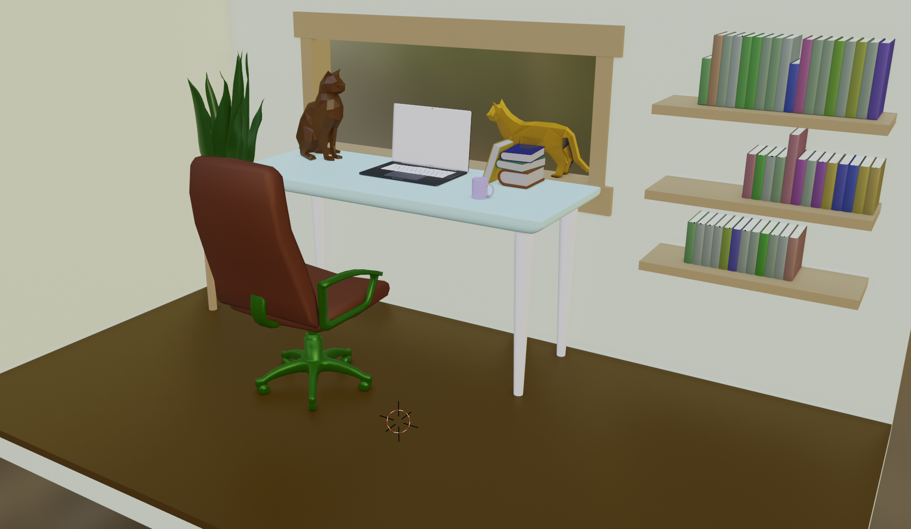

# 3D Interactive Office - Scroll Animation Experience

This project is an interactive 3D visualization of a multi-floor office space that responds to user scrolling. Built with React, Three.js, and GSAP animations.



## Demo
[Live Demo Link](https://three-house-sigma.vercel.app/)


## Features
+ Interactive 3D environment with smooth animations
+ Scroll-based navigation between multiple floors
+ Dynamic camera perspectives
+ Responsive design for various screen sizes
+ Optimized 3D model loading and rendering


## Technologies Used
+ React 18 - UI Framework
+ Vite - Build tool with fast HMR
+ Three.js - 3D rendering engine
+ React Three Fiber - React renderer for Three.js
+ GSAP - Animation library
+ Drei - Useful helpers for React Three Fiber
+ ESLint - Code quality and style


## project structure

```
three-house/
├── public/
│   ├── models/             # 3D model files (.glb, .gltf)
│   │   └── WawaOffice.glb
│   └── preview.png         # Project preview image
├── src/
│   ├── assets/             # Static assets (images, etc.)
│   ├── components/
│   │   ├── Experience.jsx  # Main 3D experience container
│   │   ├── Interface.jsx   # 2D UI overlay components
│   │   ├── Loader.jsx      # Loading screen component
│   │   ├── Office.jsx      # 3D office model and animations
│   │   └── ScrollManager.jsx # Handles scroll interactions
│   ├── constants/          # Application constants
│   ├── hooks/              # Custom React hooks
│   ├── utils/              # Utility functions
│   ├── App.jsx             # Root application component
│   ├── index.css           # Global styles
│   └── main.jsx           # Application entry point
├── .eslintrc.cjs          # ESLint configuration
├── .gitignore             # Git ignore patterns
├── index.html             # HTML entry point
├── package.json           # Dependencies and scripts
├── vite.config.js         # Vite configuration
└── README.md              # Project documentation
```

## Working with 3D Models
Models should be placed in the models directory. The project uses the GLTF/GLB format for optimal web performance. When adding new models:

1. Ensure models are properly optimized for web use
2. Use the useGLTF hook to load models
3. Add preloading for important models:
```jsx
useGLTF.preload("/models/YourModel.glb");
```

## Creating Animations
The project uses GSAP for animations. Example of adding a new animation:
```jsx
useLayoutEffect(() => {
  tl.current = gsap.timeline();
  
  // Add your animation
  tl.current.to(
    yourRef.current.position,
    {
      duration: 1,
      y: targetY,
      ease: "power2.inOut"
    },
    startTime
  );
}, []);
```
